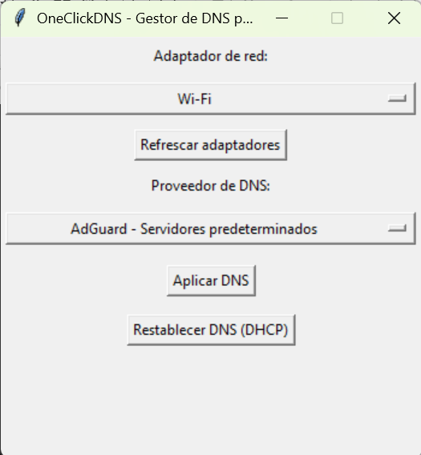

#  OneClickDNS



**Cambia tus servidores DNS en Windows con un solo clic.**  
Aplicación portable que simplifica la configuración de DNS para mejorar privacidad y seguridad.

## 📦 Descarga
[](https://github.com/gfrodriguez/OneClickDNS/releases)  
[Versión portable (.exe)](https://github.com/gfrodriguez/OneClickDNS/releases/download/v1.0.0/OneClickDNS.exe) | [Instalador](https://github.com/gfrodriguez/OneClickDNS/releases/download/v1.0.0/OneClickDNS_Setup.exe)

## 🌟 Características
- ✅ 8+ presets de DNS (AdGuard, CleanBrowsing, OpenDNS, etc.)
- ✅ Soporte para IPv4 e IPv6
- ✅ Restauración automática a DHCP
- ✅ Registro de cambios en `%APPDATA%\OneClickDNS\log.txt`
- ✅ Interfaz intuitiva

## 🛠️ Uso
1. Ejecuta como administrador (requerido)
2. Selecciona tu adaptador de red
3. Elige un proveedor DNS
4. Haz clic en **"Aplicar DNS"**


## 🚀 Compilación
Requisitos: Python 3.9+ y PyInstaller
```bash
installer\build_installer.bat